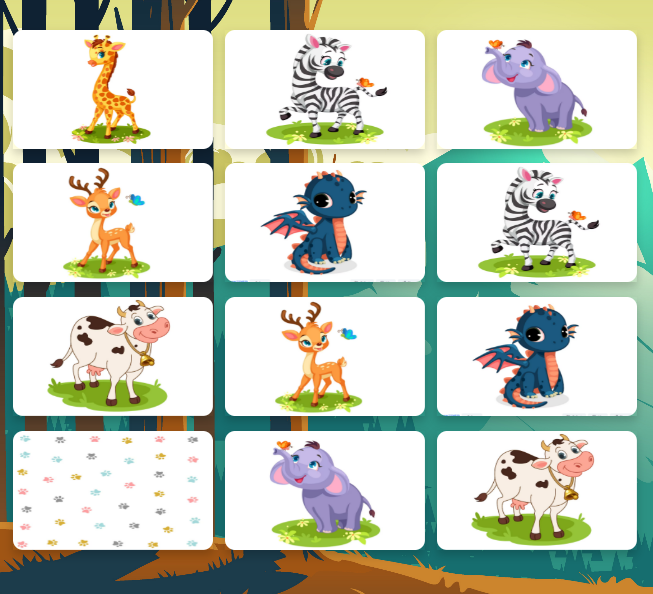
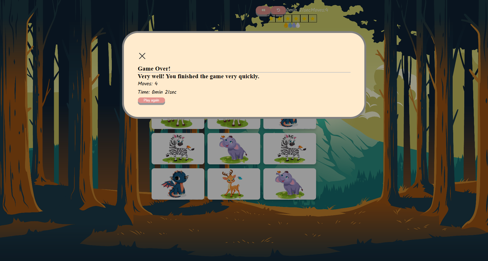
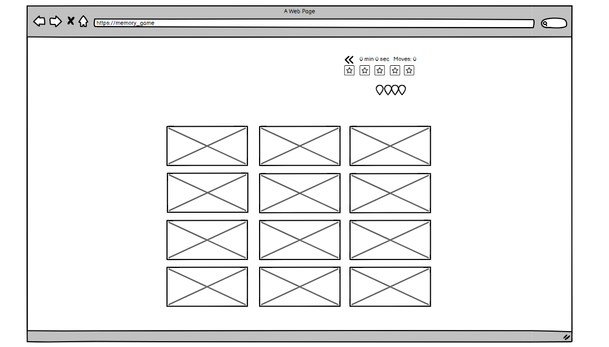

# Memory Game

Here is a very popular game called memory game. It's a fun game for both adults and children. Great exercise for memory and concentration and can make the time more pleasant. 

[View the live project here]( https://mariaarnesson.github.io/memory_game_playground/)

# Features
## User Experience 
### User stories:

- The user should be able to read the instructions of the game by reading the instructions on the homepage.
- The user should be able to see all 16 double-sided cards random selected.
- The user should be able to change the background color.
- The user should be able to see the tab by clicking on it to match it with another card.
- The user should activate the timer by clicking on button: "Game Start".
- The user should activate the move counting by pressing on the first two cards.
- The user should be able to stop the game at any time during the game by pressing "Stop Game".
- The user should receive a message when all cards have been matched and how many moves have been made at the end of the game.
- The user should be able to play again after finishing the game by pressing: "Play Game"

## The Memory Game Logo:

- When the user open the page the first thing the user can see is the Memory Games logo as well as options to start the game or read the game instructions:

- The Game Area:
    - By pressing on "Play Game" the user will continue to the other side with the game area. 
    - The Timer starts and moves are counted each time the user selects two cards.
    - The user can choose any cards and match them together:
    

 - This is what all pairs of cards look like:
 

    - This is what the different background colors of the game look like:
        - 

        - 

        - 

    - The final message looks like this:
    

## Features Left to Implement
- I would like that the user has access to difficulty levels.

# Design

## Wireframe:

### Wireframe Deskopt:

### Wireframe Ipad:

### Wireframe Iphone:

## Colour Adobe
The background of the game looks fairy-tale, encouraging the player to play, cheerful and transparent colors.

- 
- 
- 
- 
- 

# Testing

Testing information can be found in separate [TESTING.md](TESTING.md) file.

# Deployment:

- The site was deployed to GitHub pages. The steps to deploy are as follows:
    - In the GitHub repository, navigated to the Settings tab.
    - From the tab in the left hand side sidebar, select Pages.
    - Afrerword select main under branch. 
    - Click the save button.
    - The page had updated. 

# Technologies Used
## Languages Used

- [HTML](https://sv.wikipedia.org/wiki/HTML)
- [CSS](https://en.wikipedia.org/wiki/CSS)
- [Javascript](https://sv.wikipedia.org/wiki/Javascript)

# Credits

## Content:

 - Code about how to hide a div element by pressing a button. [Display Property](https://www.w3schools.com/jsref/tryit.asp?filename=tryjsref_style_display_toggle)
 - Code about how to display a modal.[Modal](https://www.w3schools.com/howto/tryit.asp?filename=tryhow_css_modal)
 - Code about how to display moves counter and timer. [Moves counter & Timer](https://medium.com/@funkiefabulous003how-to-build-a-memory-matching-game-in-javascript-fbe0bf9884a2)
 - Code about elapsed time. [Elapsed Time](https://ralzohairi.medium.com/displaying-dynamic-elapsed-time-in-javascript-260fa0e95049)

## Media:

- The sound to flip and matched cards has been downloaded from this site. [Flip card and match sounds](https://mixkit.co/free-sound-effects/game/)
- All pictures in my project were downloaded from [Freepik](https://www.freepik.com/):
    - [The cover image of the main page](https://img.freepik.com/free-vector/cartoon-forest-background-nature-landscape-with-deciduous-trees-moss-rocks-grass-bushes-sunlight-spots-ground-scenery-summer-spring-wood-parallax-natural-scene-vector-illustration_107791-9113.jpg?w=1380&t=st=1684933332~exp=1684933932~hmac=0cf5b242f3a328f6e9f1e07cd12e24f839ee23a8a9017e47293652a987fe9809)
    - [Background in shades of yellow](https://img.freepik.com/free-vector/autumn-landscape-with-swamp-forest_107791-4624.jpg?w=1380&t=st=1676635346~exp=1676635946~hmac=95f4739b27d12c7c68acb06539af0b34088dcaaf025b9d48de4a1028a0af3b1d)
    - [Background in shades of blue](https://img.freepik.com/free-vector/woman-girl-summer-camp-night_107791-11572.jpg?w=1380&t=st=1676635454~exp=1676636054~hmac=8c961b42435a3793f592eadf687dc846ce5ee5c12e098d8803a667aa0420ed7e)
    - [Background in shades of grey and purple](https://img.freepik.com/free-vector/night-forest-with-camp-fire-river-mountains_107791-6993.jpg?w=1380&t=st=1676633073~exp=1676633673~hmac=0f1969a485bee8d91bb929af0a58aaf57762936a000c2d680488f9438515f371)
