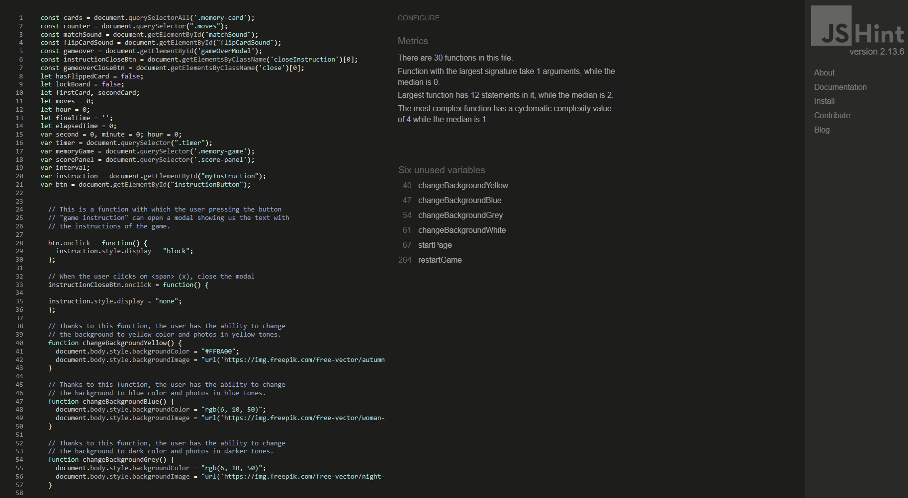

# Memory Game - Testing details

# Automated Testing

## Testing Validator

- [HTML Validator](https://validator.w3.org/#validate_by_input)
    - result for index.html
        - 
        - [result_part1](test/test_validator/test_result_validatorhtml_part1.png)
        - [result_part2](test/test_validator/test_result_validatorhtml_part2.png)
        - [result_part3](test/test_validator/test_result_validatorhtml_part3.png)

- [CSS Validator](https://jigsaw.w3.org/css-validator/#validate_by_input)
    - 
    - [result_css_part1](test/test_validator/validator_css_part1.png)
    - [result_css_part2](test/test_validator/test_result_validatorcss_part2.png)
    - [result_css_part3](test/test_validator/test_result_validator_css_part3.png)
    - [result_css_part4](test/test_validator/test_result_validator_css_part4.png)
    - [result_css_part5](test/test_validator/test_result_validator_css_part5.png)
    - [result_css_part6](test/test_validator/test_result_validator_css_part6.png)

- [Javascript Validator](https://jshint.com/)
    - 

# Manual Testing

### Testing User Experience (UX) stories:

- as a user I want to be able to read the instructions of the game by reading the instructions on the homepage.
    - After loading the page, an icon appears on the main page, after pressing on it, we can read the instructions of the game.
- as a user I want to be able to see all 12 double-sided cards random selected.
    - After loading the page, the "play game" button is shown, after pressing it, we can see the page showing game board with 12 cards.
- as a user I want to be able to change the background color.
    - When the game board loads, it also shows 4 icons in different colors. By clicking on them, we can change the design of the entire page (background and board game).
- as a user I want to be able to see the card by clicking on it to match it with another card.
    - Starting the game and pressing on one of the cards, the card rotates so that the user can see what picture is on it and can easily find the card that matches it.
- as a user I want to be activate the timer to the game. 
    - The timer is activated when the game started and the user turned over the first card.
- as a user I want to be activate the move counting. 
    - The move counting is activeted by pressing on the first two cards.
- as a user I want to be able to stop the game at any time during the game.
    - To stop the game, user can press a back button on the top left of the game board.
- as a user I want to be receive a message when all cards have been matched and how many moves have been made at the end of the game.
    - The message with the number of steps and time is always shown after the game is over.
- as a user I want to be able to play again after finishing the game by pressing: "Play Game"
    - The "Play again" button always shows up in the final message.

### Test Cases and Results

1. Home Page:
- After the page loads:
    - An computer generated 2d photo is shown in the background. 
    - The title of the game 'Memory game' is shown, the text is written in large font, in the color of tomates. 
    - Below the user can see two buttons: "Play Game" and "Game Instructions".
        - when the user selects: "game instruction", the modal opens, darkening the entire page, and a div opens in sight where the user can read the description of the instruction game.
        - By selecting the "play Game" option, a new page is loaded where the user has the possibility to start the game.

2. Game Board Page:
- After the page loads:
    - An computer generated 2d photo is shown in the background. 
    - The game board is displayed: 
        - On the top left, there is an icon with a back arrow, which means that by pressing on it, the user goes to the previous page.
        - At the top in the center there are 4 droplet icons. Each of them has a different color, and after pressing each of them, the user has the opportunity to change the design of the entire page, i.e. the background and the game board.
        - At the top right there is an icon with a curled arrow. By clicking on it, the user has the possibility to start the game from the beginning.
        - In line below:
            - There are 6 star icons on the left side. At the beginning of the game, all stars are invisible, but when finding each pair, one of the stars appears one at a time.
            - In the center is a button with the number of moves that the user makes while clicking on pairs of cards.
            - On the right site is a time generator that turns on automatically when the user press the first pair of cards.
        - Below are 12 cards that are shown from the outside. When pressing on each card, a sound appears. When a pair of cards do not match, they are flipped over again. When a pair matches (has the same picture), a different sound occurs and the pair is not flipped again.
        
         - When the user has successfully preessing on all the cards and found the pairs, the final modal is displayed:
            - when the modal is displayed, the whole page is darking and a div appears in focus with the final results.
                - Inside the div, at the top, the icons of the hearts left are displayed.
                - Below an icon with a walking person is displayed, the text: "Your Moves:", and a button with the number of movements made by the user.
                Below is an icon with an hourglass, the text: "Your Time:", and a button with the time in which the user made the entire game.
                - Below is the "Play Again" button. After clicking on it, the user has the option to start the whole game over again.
                - On the upper right site is: "x" . By clicking on it, the user can easily close the modal.       

## Testing on desktop
All steps are performed in browsers:
 - Chrome - Version 111.0.5563.65 (Officiell version) (64 bitar)
 - Microsoft Edge - Version 111.0.1661.44 (Officiell version) (64 bitar)
 - Firefox - 111.0 (64-bitars)

 All steps have been entered and checked both in the Firefox browser on the tablet and in the iPhone browser.

 #### Home Page:

- The Play Game button has been pressed and confirmed to take the user to the page with game board.
- The Instructions Game button has been pressed and confirmed to take the user to the Game Instructions Modal. 
- The close span was pressed to check if the modal disappears when pressed on it. The effect has been confirmed to be correct.

#### Game Board Page:
- The Back button has been pressed and confirmed to take the user back to Home page.
- All droplet icons has been pressed and confirmed that the background image changes.
- Memory cards has been pressed. The effect has been confirmed to be correct.
- It has been confirmed that the move counter is correct and the number of steps appears every time a pair of cards has have been flipped.
- It has been confirmed that the timer is correct and is on after the move conuter is on. 
- The Restart button has been pressed and confirmed that the game has been reset so that the player can start the game from the beginning.
- It has been confirmed that game over modal starts right after the game ends and the content text is correct.
- The close span was pressed to check if the modal disappears when pressed on it. The effect has been confirmed to be correct.
- It has been confirmed that after pressing the play button again, the user is able to start a new game.
              